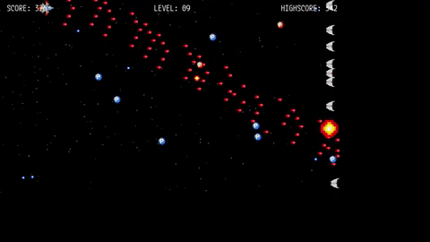

# Repository Overview


A simple endless shooting game developed using C++ and SDL2.

This repository is for the Capstone project required for completing [Udacity C++ Nanodegree Program](https://www.udacity.com/course/c-plus-plus-nanodegree--nd213). 

Current state of the program has several features below.

- It has five states - e.g. Title, Running, GameOver, Highsocre showing, Highscore gained.
- It catches user inputs and move player spaceship and fire enemies.
- It reads graphics of each objects appear in this game, sound data, highscore table and font data.

# Dependencies for Running Locally 

- cmake >= 3.11.3
  - All OSes: [click here for installation instructions](https://cmake.org/install/)

- make >= 4.1 (Linux, Mac), 3.81 (Windows)
  - Linux: make is installed by default on most Linux distros
  - Mac: install [Xcode command line tools to get make](https://developer.apple.com/xcode/features/)
  - Windows: [Click here for installation instructions](http://gnuwin32.sourceforge.net/packages/make.htm)

- SDL2 >= 2.0 (Linux)
  - All OSes: [click here for installation instructions](https://wiki.libsdl.org/Installation)
    for linux, run `sudo apt-get install libsdl2-dev libsdl2-image-dev libsdl2-mixer-dev libsdl2-ttf-dev`.

- gcc/g++ >= 5.4
    Linux: gcc / g++ is installed by default on most Linux distros
    Mac: same deal as make - [install Xcode command line tools](https://developer.apple.com/xcode/features/)
    Windows: recommend using [MinGW](https://www.mingw-w64.org/)

! This repository has been successfully built and tested on Ubuntu 18.04 running C++17.

# Basic Build & Run Instructions

1. Clone this repo.
2. Make a build directory in the top level directory: `mkdir build && cd build`
3. Compile: `cmake .. && make`
4. Run it: `./SDL_Shooter`

or just run `run.sh`

1. `bash run.sh`


# File Structure

This repository contains

- `run.sh` Script for running this project
- `CMakeLists.txt`: cmake configuration file
- `README.md`: This file
- `cmake/`: Contains another CMake configuration files, for complilation of SDL2 Libraries
- `highscore`: Contains hishscore.txt, for retaining highscore information
- `src/`: Source. Contains header files, too.
- `sound/`: Contains sound files.
- `img/`: Contains image files.
- `ttf/`: Contains ttf files.
- `resource/`: Contains Demo file.

```
├─ run.sh
├─ CMakeLists.txt
├─ README.md
├─ cmake  # For CMake, Compile SDL2 Libraries
│　  ├ FindSDL2_image.cmake
│　  ├ FindSDL2_mixer.cmake
│　  ├ FindSDL2_ttf.cmake
├─ highscore
│　  ├ highscore.txt
├─ resource
│　  ├ demo.gif
├─ src
│　  ├ main.cpp
│　  ├ game.h
│　  ├ game.cpp
│　  ├ gamestate.h
│　  ├ gamestate.cpp
│　  ├ controller.h
│　  ├ controller.cpp
│　  ├ renderer.h
│　  ├ remderer.cpp
│　  ├ sound_player.h
│　  ├ sound_player.cpp
│　  ├ object.h
│　  ├ object.cpp
│　  ├ player.h
│　  ├ player.cpp
│　  ├ bullet.h
│　  ├ bullet.cpp
│　  ├ enemy.h
│　  ├ enemy.cpp
│　  ├ enemy_bullet.h
│　  ├ enemy_bullet.cpp
│　  ├ debris.h
│　  ├ debris.cpp
│　  ├ pod.h
│　  └ pod.cpp
├─ sound　   
│　  ├─ BGM
│　  │　　 └ bgm.mp3
│　  └─ effect
│　  　 　　 ├ explode.wav
│　  　 　　 ├ Level_Up.wav
│　  　 　　 ├ pod.wav
│　  　 　　 ├ select.wav
│　  　 　　 └ shot.wav
├─ img
│　  ├─ bullet
│　  │　　 ├ bullet.png
│　  │　　 └ enemy_bullet.png
│　  ├─ debris
│　  │　　 ├ debris1.png
│　  │　　 ├ debris2.png
│　  │　　 └ debris3.png
│　  ├─ enemy
│　  │　　 ├ enemy.png
│　  │　　 └ explosion.png
│　  ├─ player
│　  │　　 └ player.png
│　  └─ pod
│　  　　　 ├ pod.png
│　  　　　 └ power_pod.png
└─ ttf 
　　  └ Mplus1Code-Regular.ttf
```

# Class Structure

- `Game` : Manage the entire state of this game. This class has `Conrtoller` instance, `Renderer` instance and container of all `Object`.
- `Controller` : Handling user inputs
- `Renderer`: Render Objects based on the objects stored in `Game` instance.
- `Object`: All objects appear in this game is inherited from this object.

# How to play this game

Press Space key at title window. Then game starts.

- ↑↓←→ … Move player
- F … Fire the enemy

# License

- source files are MIT Lisence
- BGM / Sound Effect by OtoLogic(CC BY-4.0)
- SDL2 (zlib license)


